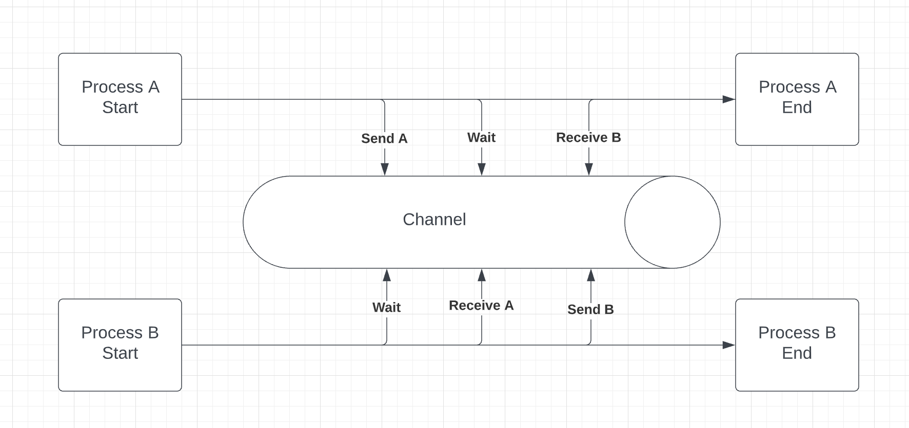
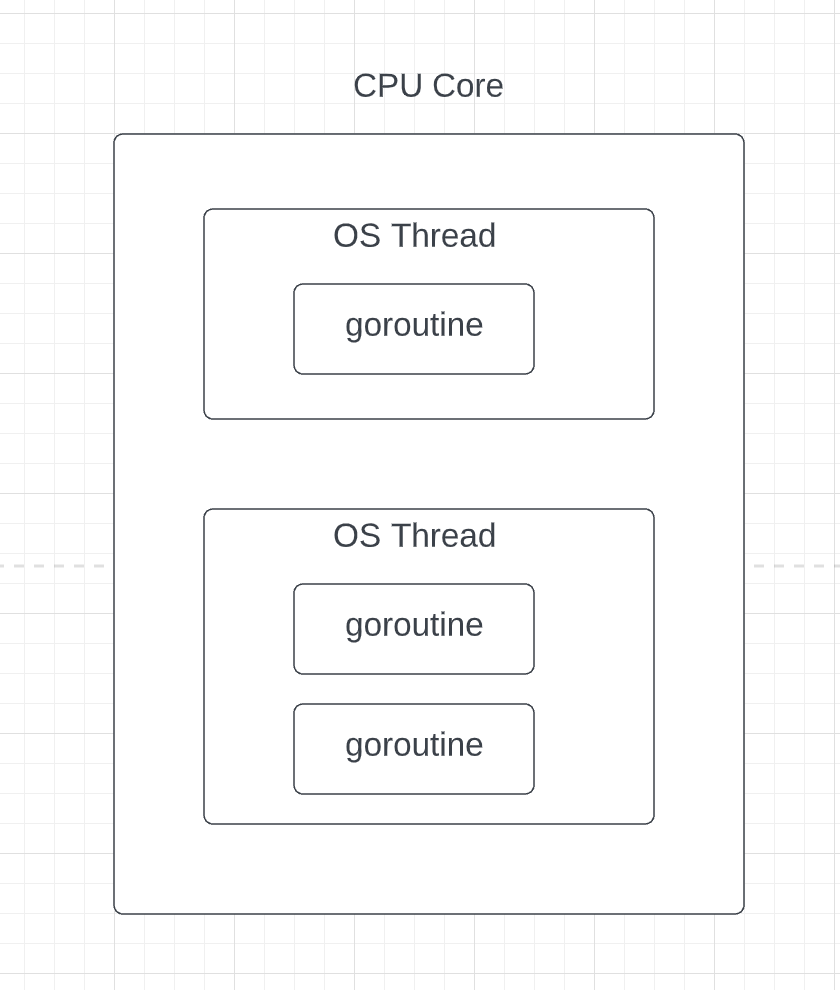

# Concurrency and CSP

- The Go programming language was designed upfront with concurrency in mind. Its concurrency model is based on **Communicating Sequential Processes** (CSP).
- The CSP model is a concurrency paradigm that relies on *message passing*. Instead of having to share memory, processes will communicate by exchanging messages through *channels*.
- 

- Go implements the CSP model with two primitives: the *goroutine* and the *channel*

- A goroutine can be seen as a lightweight thread. 

- Unlike threads that are scheduled by the OS, goroutines are scheduled by the *Go runtime*.

- One goroutine belongs to one thread at a time, and one thread can handle multiple goroutines.

- 

  

- The OS schedules OS threads on CPU Cores.

- The Go runtime schedules goroutines on OS threads.

- The OS is in charge of scheduling threads on the CPU cores. 

- The Go runtime determines the most appropriate number of Go threads depending on the workload and schedule the goroutines on these threads.

- Compared to a thread, the cost of creating a goroutine is cheaper in terms of startup time and memory (only 2KB of stack size).

- The context switching operation from one goroutine to another is also faster than context switching threads.

- A *channel* is the data structure that allows exchanging data between different goroutines.

- Each message sent to a channel is received by **at most** one goroutine.

- The only broadcast operation (1-to-N) is a **channel closure** that propagates an event received by multiple goroutines.

  